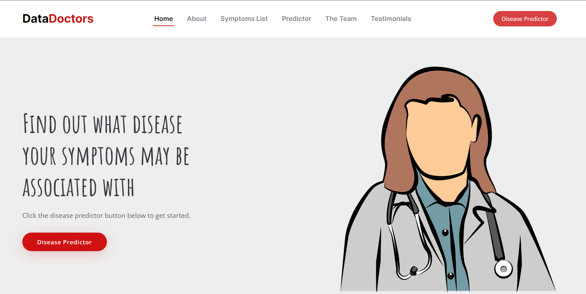
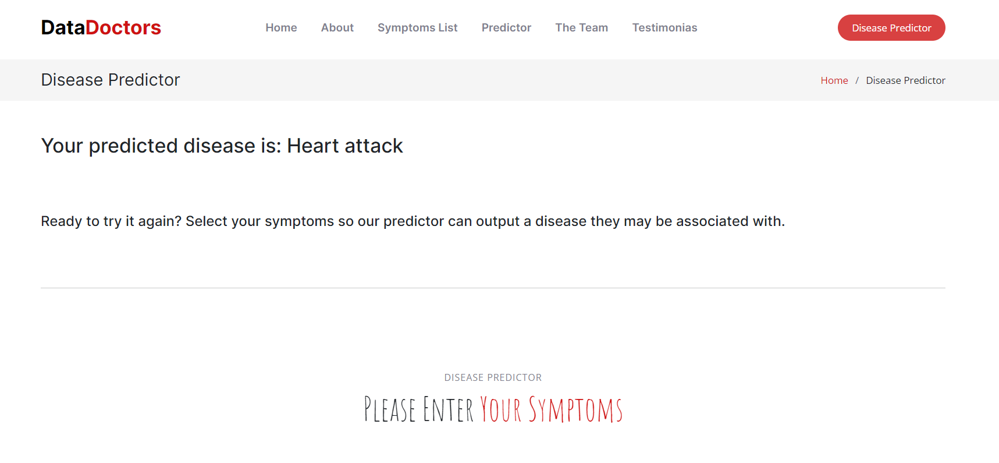

# Data Doctors
Danielle Sears, James Strale, Maite Rivas & Sydney Cohen 

## Project Overview
For this project, we trained a machine learning model to analyze a number of symptoms, and added it to a function in order to give feedback for a predicted disease based off of users' input.

### Dataset Used 
In order to train and test our model, we used this [Kaggle dataset](https://www.kaggle.com/datasets/itachi9604/disease-symptom-description-dataset) created by Pranay Patil. 

### Tools Used
Pandas will be used to clean and prepare the data. SciKitLearn will be used to scale the data. We will compare the efficacy of the RandomForestClassifier and the DecisionTreeClassifier. After assessing the classifiers, they were both found to have 100% testing and training scores. The team decided to move forward with the RandomForestClassifier and put it into the main predictor function.

In order to have an interactive front end that runs the predictor function, the team created a Flask App with well-designed HTML pages so that users would easily be able to see symptom options, input their symptoms and click the Disease Predictor button to return a result that is displayed on the webpage. 

### Showcasing Results
Our front end is an interactive webpage that takes in user provided symptoms and returns a disease that is predicted to be associated with those symptoms. Please find our slideshow with more extensive details [here](https://docs.google.com/presentation/d/1vGISH59ENi883PPaczwJf3Uf1-MP1FOmoFwQ7Pr13cg/edit?usp=sharing).

To run the webpage yourself, clone our repo and open the data-doc-app folder on your local machine. Run the app.py file in your terminal. This deploys the app to a development server that has full app functionality. Below is a screenshot of what the output page looks like after you enter your symptoms and submit them. There is also an option on the output page to enter a new set of symptoms. 

### Limitations 
Our dataset was relatively small with just over 4,000 rows of data. Additionally, some symptoms had similar definitions but were correlated to different diseases in the dataset due to lack of specificity. A larger dataset with more cohesive symptoms may improve the accuracy of the machine learning model and its deployment. 
